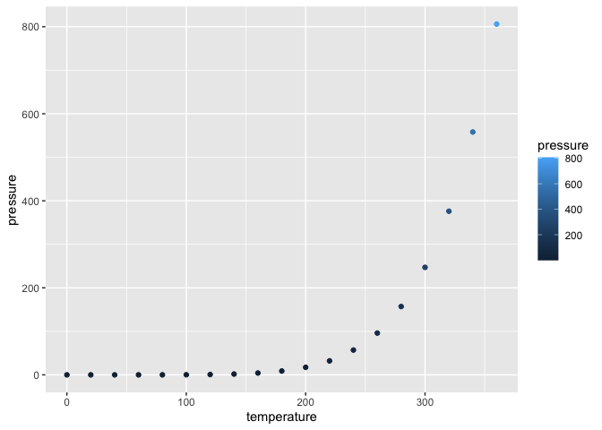

Problem Set 07
================

``` r
data(pressure)
library(ggplot2)
```

# Learning GitHub

## GitHub Documents

This is an R Markdown format used for publishing markdown documents to
GitHub. When you click the **Knit** button all R code chunks are run and
a markdown file (.md) suitable for publishing to GitHub is generated.

## ggplot2 plot

<!-- -->
